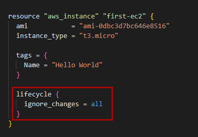
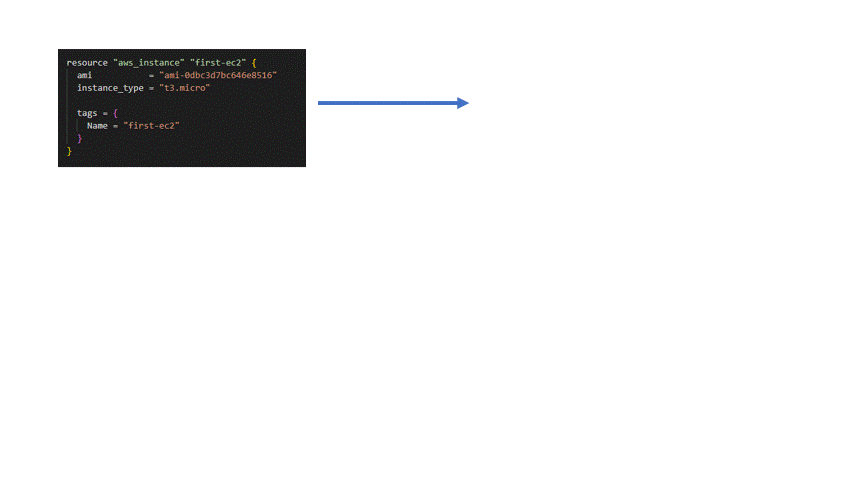
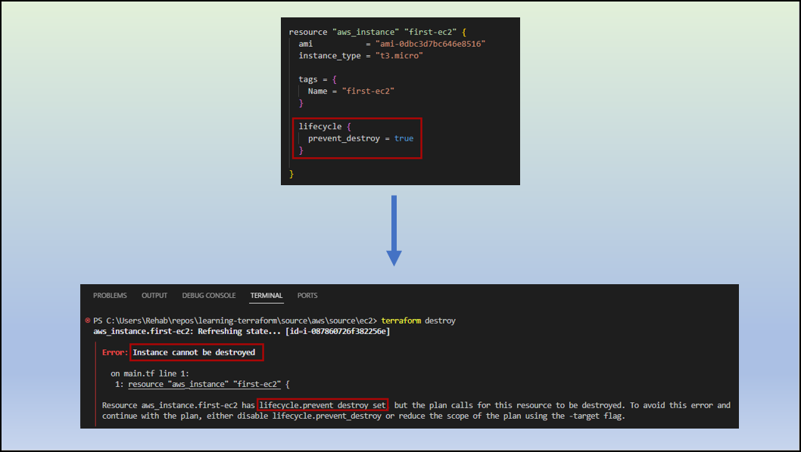
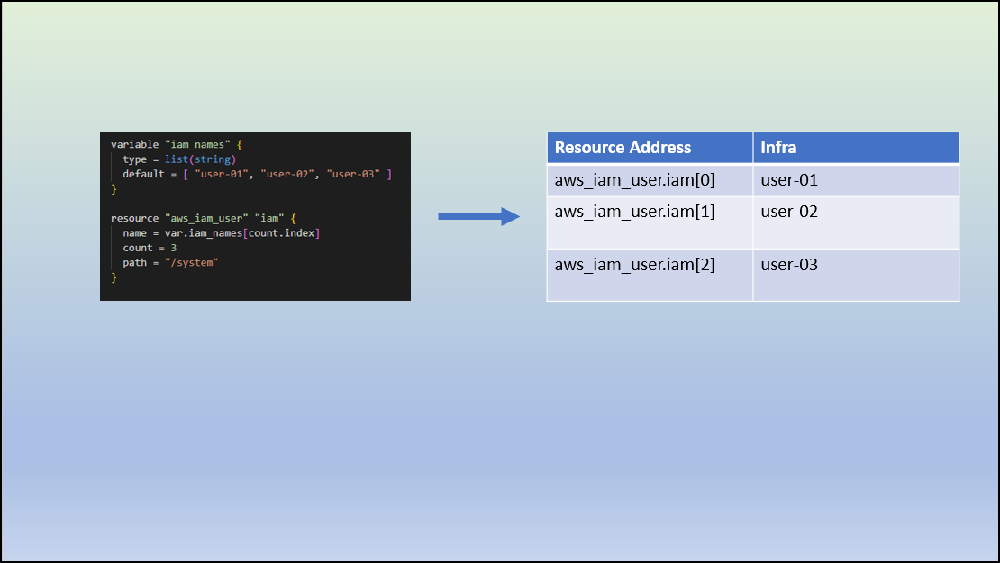
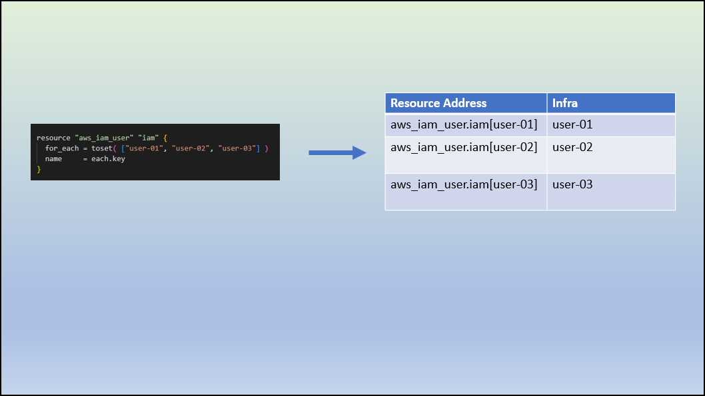
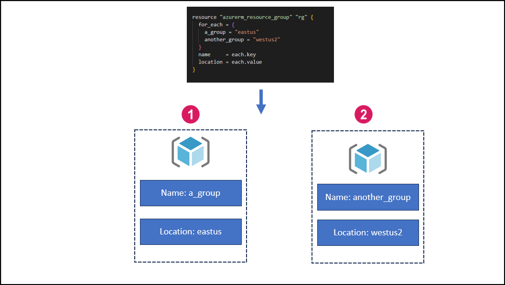

## Resource Behavior

Applying Terraform configuration will:

- Create resources that exist in the configuration but are not associated with a real infrastructure object in the state.
- Destroy resources that exist in the state but no longer exist in the configuration.
- Update in-place resources whose arguments have changed (ex: add a tag to EC2).
- Destroy and re-create resources whose arguments have changed but which cannot be updated in-place due to remote API limitations (ex: change the EC2 AMI)

This default behavior can be customized using `meta-arguments` within resource block.

|Argument                | Description                                                                   |
|------------------------|-------------------------------------------------------------------------------|
|lifecycle               |Define certain lifecycle behaviors for a resource                              |
|count                   |Create multiple instances of a resource based on a numeric value               |
|for_each                |create multiple instances of a resource based on a map or a set of values      |

## Lifecycle Argument

Define certain lifecycle behaviors for a resource.

The arguments available within a lifecycle block are:

- ignore_changes
- create_before_destroy
- prevent_destroy
- replace_triggered_by

### ignore_changes

A list of attribute names for which changes should be ignored during updates. This can be useful when certain attributes may change due to external factors, but you don't want Terraform to consider those changes when deciding whether to recreate the resource.

**Example:** Imagine you have a Terraform configuration creating an EC2 instance tagged as `Name = "Hello World"`. Now, someone manually adds a tag, `Env = "Test"`, directly in the cloud.

Normally, when you run `terraform apply` again, Terraform notices the extra tag and removes it because it's not in your configuration.

But, what if you want Terraform to just let it be? This is where `ignore_changes` comes in.

By using ignore_changes, you're basically telling Terraform, "Hey, don't worry about certain changes; I've got it covered." It ensures that Terraform won't mess with the specific attributes you specify, even if they change externally.

**❗ Note ❗**

To simplify the process of ignoring all attributes in Terraform, you can utilize the `all` keyword. Rather than creating a list specifying individual changes to be ignored, you can use `all` to instruct Terraform to ignore all attributes.

### create_before_destroy

By default, if Terraform encounters a need to modify a resource argument that cannot be updated in-place due to remote API limitations, it will proceed by destroying the current object and subsequently creating a new replacement object with the updated configuration.

The introduction of the `create_before_destroy` meta-argument alters this process, ensuring that the new replacement object is generated first, and only after its creation is completed does Terraform proceed to destroy the previous object.

### prevent_destroy

Setting the `prevent_destroy` meta-argument to true in the configuration will make Terraform raise an error if any plan attempts to destroy the associated infrastructure object, as long as the prevent_destroy argument is still present in the configuration.

**❗ Note ❗**

Since this argument must be present in configuration for the protection to apply, note that this setting does not prevent the remote object from being destroyed if the resource block were removed from configuration entirely

## count

The count argument in Terraform is used to create multiple instances of a resource based on a numerical value. It allows you to create multiple copies or instances of a resource with similar configurations but different names or properties.

By specifying a value for count, you can control the number of resource instances that Terraform should create. Each instance will be assigned an index starting from zero (0) up to the specified count minus one.

**❗ Note ❗**

The count argument works well when resources are identical. However, if you need distinct values for each resource, it's better to use `for_each`.

## for_each

The for_each argument in Terraform is used to create multiple instances of a resource based on a map or a set of values. Instead of using count, which works with a numeric value to specify the number of resource instances, for_each is used when you want to create resources for each element in a map or set.

