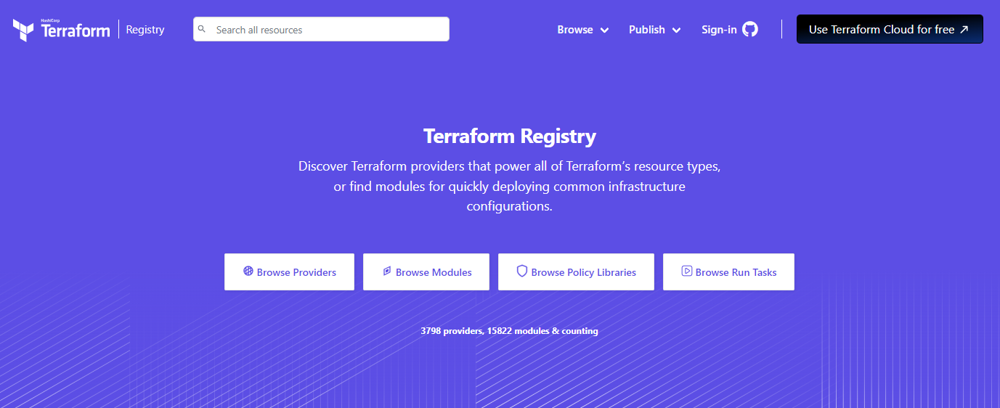
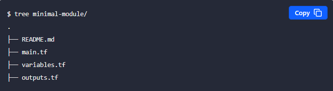
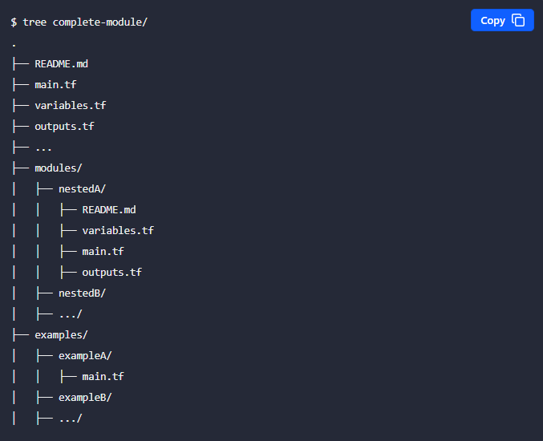

## Terraform Modules: 

Modules are a way to organize and structure your configuration code into reusable units. A module is a collection of Terraform files (.tf), along with any associated files, that represent a set of resources and their configurations. This helps in creating a higher level of abstraction, making it easier to manage and reuse code in different parts of your infrastructure.

To use a module in your Terraform configuration, you would use the module block and provide the source location. For example:

```
module "example" {
  source = "./path/to/my_module"
  // other variables as needed
}

```

### Outputs in Modules

Outputs in modules are a way to expose certain values or results of the module's computations to the calling module or the main configuration.

You can access the module output values like the following: `module.<MODULE_NAME>.<OUTPUT_NAME>`.

```
# Inside the module

output "instance_ids" {
  value = aws_instance.example[*].id
}

```

```
# In the main configuration

# You can then use the outputs as needed in the calling module
resource "external_resource" "example" {
  # Using the instance_ids output from the module
  instance_ids = module.example_module.instance_ids
}

```

### Terraform Registry

Platform for the Terraform community to publish and access reusable modules that can be easily integrated into Terraform configurations. 
Anyone can publish and share modules on the Terraform Registry.



### Requirements for Publishing Modules to Terraform Registry

|Requirement                              |Description                                                                    |
|-----------------------------------------|-------------------------------------------------------------------------------|
|GitHub                                   |For public registry the module must be on GitHub and must be a public repo     |
|Named                                    |Module repositories must use the following name: `terraform-<PROVIDER>-<NAME>` |
|Repository Description                   |Should be a simple one sentence description of the module                      |
|Standard module structure                |Must adhere to the standard module structure                                   |
|`x.y.z` tags for releases                |Release tag names must be a semantic version                                   |

### Standard Modules Structure





### Module Sources

- Local paths

- Terraform Registry

- GitHub

- Bitbucket

- Generic Git, Mercurial repositories

- HTTP URLs

- S3 buckets

- GCS buckets

- Modules in Package Sub-directories

### Resources

[Modules](https://developer.hashicorp.com/terraform/language/modules)

[Terraform Registry Publishing](https://developer.hashicorp.com/terraform/registry)
