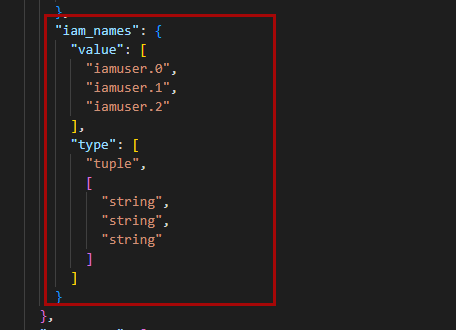
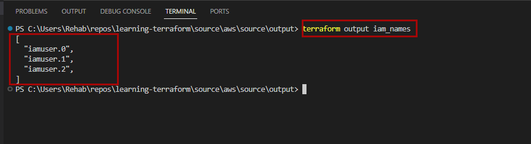

## Output Values

In Terraform, output values show specific information to users after creating or updating infrastructure, similar to return values in programming.

Remember, outputs appear only when applying a Terraform plan; running terraform plan alone won't show them.

Here's how you define an output:

```
output "iam_names" {
  value = aws_iam_user.lb[*].name
}

```
After applying the plan, output values are stored in the Terraform state file.



You can easily extract the value of an output variable from the state file using the output command:

`terraform output <OUTPUT>`


