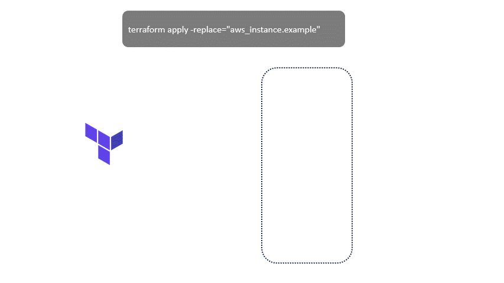

## Replace Option

The `-replace` option is used with terraform apply to replace resources. When a resource needs to be replaced, Terraform will destroy the existing resource and create a new one.

This option is only available from Terraform `v0.15.2` onwards. For earlier versions, use `terraform taint` to achieve a similar result.

## Documentation

[Command: taint](https://developer.hashicorp.com/terraform/cli/commands/taint)

[Planning Options](https://developer.hashicorp.com/terraform/cli/commands/plan#replace-address)